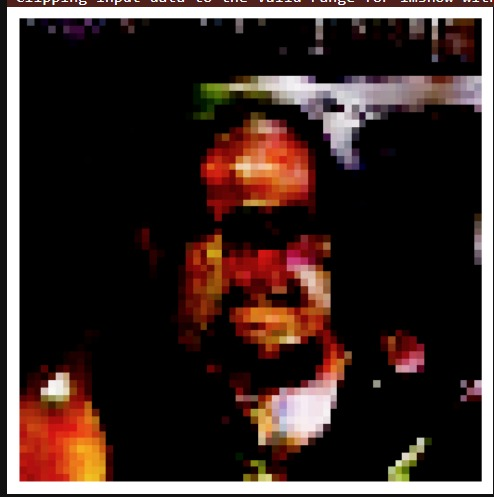
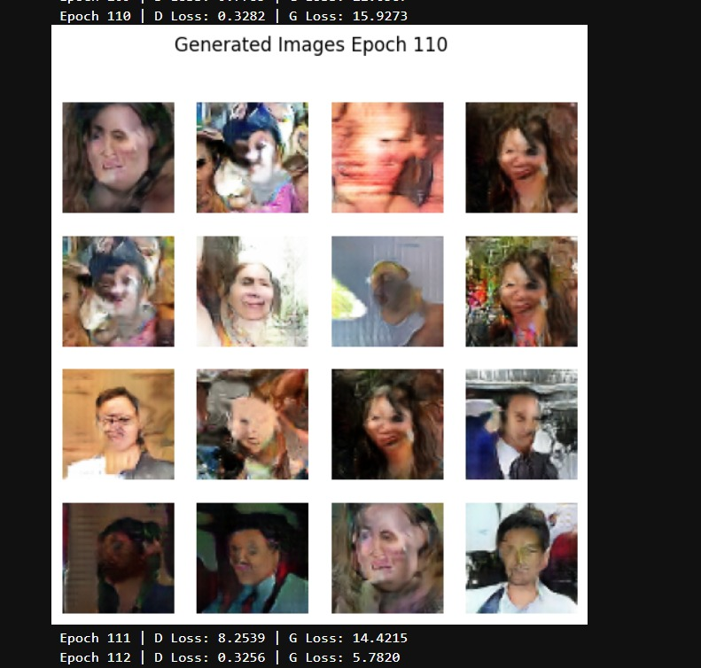

# Deepfake Video Detection

This project currently includes two scripts:

1. `deepfake_img.py` for image deepfake detection and GAN-based generation.
2. `deepfake_voice.py` for audio deepfake detection with a hybrid model.

This project focuses on detecting deepfake content seen across the internet.

## Project Status

**Currently in Stage 1: Core Deepfake Detection Foundation**

Stage 1 is actively focused on building a strong base system for image and voice deepfake detection.  
This phase establishes the core models, training pipelines, and evaluation flow that will power future video and source-tracing capabilities.

## Development Stages

1. **Stage 1 (Current):** Deepfake detection from images and audio.
2. **Stage 2 (Future):** Deepfake detection from video streams.
3. **Stage 3 (Future):** Source tracing to identify the address/origin of deepfake-generated content.
  
## Project Files

- `deepfake_img.py`: End-to-end image pipeline (classification + GAN).
- `deepfake_voice.py`: End-to-end voice pipeline (audio preprocessing + hybrid classifier training).
- `Readme.md`: Project documentation.

## Deepfake Image

### First Pixel Generated



### GAN Training Progress (Epoch-wise)

The following outputs show how image generation improves over training epochs:

1. **Epoch 0 (Initial Output)**


2. **Epochs 1 to 10 (Early Learning Phase)**


3. **Epoch 110 (Final Output)**



### Progress Summary

- **Epoch 0:** Output is mostly noisy and lacks clear structure.
- **Epochs 1-10:** Basic patterns start to appear as the generator begins learning.
- **Epoch 110:** Generated output is significantly more coherent, showing learned visual features.

### Image Dataset Structure

The image script expects a zip file named `deepfake.zip` in the project root.

After extraction, expected folders are:

```text
dataset/
    deepfake/
        real/
            *.jpg|*.png|...
        Fake/
            *.jpg|*.png|...
```

Notes:
- Folder names are case-sensitive in code: `real` and `Fake`.
- Images are resized to `64x64` during loading.

### What `deepfake_img.py` Does

1. Extracts the image dataset and previews samples.
2. Trains a CNN discriminator to classify Real vs Fake.
3. Evaluates the discriminator (loss, accuracy, confusion matrix).
4. Trains a GAN loop for generation.
5. Saves model checkpoints.

### Image Outputs

- `discriminator_model.pth`: trained discriminator weights.
- `gan_checkpoint.pth`: GAN checkpoint with `epoch`, `G`, `D`, and optimizer states.

## Deepfake Voice

### Voice Pipeline Summary (`deepfake_voice.py`)

The voice script builds a combined dataset from:

- ASVspoof 2019
- Fake-or-Real dataset
- WaveFake dataset

### Voice Dataset Labeling Logic

- ASVspoof labels are parsed from protocol text files.
- In this project mapping:
  - `bonafide -> 0` (real)
  - `spoof/fake -> 1` (fake)
- Fake-or-Real labels are inferred from folder names (`real` or `fake`).
- WaveFake files are treated as fake (`1`).

### Voice Data Preparation

- Audio extensions used: `.wav`, `.flac`
- Train/validation split is stratified (`test_size=0.2`).
- Current script caps sample counts as:
  - Train subset: first `20000` items
  - Validation subset: first `5000` items

Then it performs:

1. Audio loading (`.wav` and `.flac`).
2. Resampling to `16 kHz`.
3. Mono conversion.
4. Waveform normalization.
5. Fixed-length trim/pad to `3 seconds`.
6. Mel-spectrogram conversion (`n_mels=64`, `n_fft=400`, `hop_length=160`) with log scaling.

### Voice Features and Model

- Mel spectrogram branch (CNN):
  - Conv2d(1->16), MaxPool
  - Conv2d(16->32), MaxPool
  - AdaptiveAvgPool to `8x8`
- Handcrafted feature branch:
  - MFCC mean + MFCC std (`13 + 13`)
  - Zero-crossing rate (`1`)
  - Total handcrafted features: `27`
- Hybrid classifier:
  - Concatenate CNN embedding + feature embedding
  - Fully connected binary output with sigmoid

### Input and Output Shapes (Voice Model)

- Input 1: log-mel spectrogram tensor (`1 x 64 x T`)
- Input 2: handcrafted feature vector (`27` values)
- Output: single probability score in `[0, 1]` for fake/real classification

### Voice Training Behavior

- Loss: `BCELoss`
- Optimizer: `Adam` (`lr=0.002`)
- Epochs: `25`
- Batch size: `16`
- Uses gradient clipping (`max_norm=1.0`)
- Prints validation accuracy after training

### Current Voice Script Limitations

- Dataset paths are hardcoded to Kaggle-style directories.
- Script currently prints accuracy but does not save a `.pth` voice checkpoint.
- No confusion matrix/classification report is exported yet.

## Loss Function and Mathematical Formulation

Main work currently focuses on improving loss behavior during training for stable image/audio deepfake classification.

### Binary Cross-Entropy Loss (used in current classifiers)

For predicted probability $\hat{y}$ and ground-truth label $y \in \{0,1\}$:

$$
\mathcal{L}_{BCE}(y, \hat{y}) = -\Big(y\log(\hat{y}) + (1-y)\log(1-\hat{y})\Big)
$$

For a batch of size $N$:

$$
\mathcal{L}_{batch} = \frac{1}{N}\sum_{i=1}^{N} -\Big(y_i\log(\hat{y}_i) + (1-y_i)\log(1-\hat{y}_i)\Big)
$$

### GAN Objective (image generation block)

Discriminator objective:

$$
\max_D\; \mathbb{E}_{x\sim p_{data}}[\log D(x)] + \mathbb{E}_{z\sim p_z}[\log(1-D(G(z)))]
$$

Generator objective:

$$
\min_G\; \mathbb{E}_{z\sim p_z}[\log(1-D(G(z)))]
$$

In practice, training minimizes equivalent loss functions with gradient-based optimizers (Adam).

### Important Note

The current voice script uses hardcoded Kaggle paths. If you run locally, update those paths to your local dataset directories before execution.

## Requirements

Install dependencies before running:

```bash
pip install torch torchvision torchaudio
pip install numpy pandas matplotlib opencv-python scikit-learn ipython
```

If using GPU, install the CUDA-compatible PyTorch build from the official PyTorch selector.

## How to Run

### Run Image Script

1. Place `deepfake.zip` in the project root.
2. Ensure the zip contains `deepfake/real` and `deepfake/Fake`.
3. Run:

```bash
python deepfake_img.py
```

### Run Voice Script

1. Update dataset paths in `deepfake_voice.py` to match your environment.
2. Run:

```bash
python deepfake_voice.py
```

## Current Notes

- Both scripts are single-file, notebook-style pipelines.
- Paths and most hyperparameters are currently hardcoded.
--------------------------------------------------------------------------------------------------
# Developed by 
1. Zainab Sayeed 
2. Sameer sinha 
3. Sreerag s Kumar 
4. Tejas Agrawal 